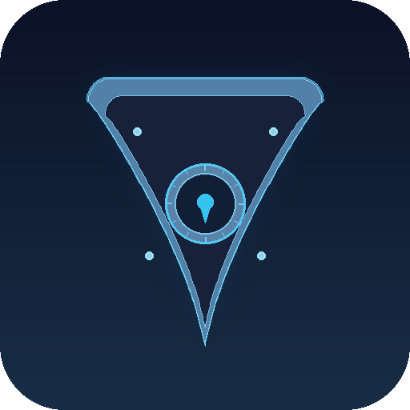

<p align="center">
  
</p>

<h1 align="center">AxiomVault</h1>

<p align="center">
  Cross-platform encrypted vault with client-side encryption, built in Rust.
</p>

<p align="center">
  <a href="https://github.com/5queezer/axiom-vault/actions/workflows/rust-ci.yml"></a>
  <a href="https://github.com/5queezer/axiom-vault/actions/workflows/pr-check.yml"></a>
  <a href="https://github.com/5queezer/axiom-vault/releases/latest"></a>
  <a href="https://github.com/5queezer/axiom-vault/blob/master/LICENSE"></a>
</p>

---

> [!WARNING]
> This project is in **early development** and is **not production ready**. APIs may change, features may be incomplete. Do not use for storing sensitive data in production.

## Overview

AxiomVault encrypts your files locally before they touch any cloud service. A single Rust core powers every platform &mdash; no JVM, no Electron, just native performance with native UIs.

**Platforms:** Linux, macOS, iOS, Android
**Clients:** CLI, Desktop (Tauri), macOS (SwiftUI), iOS (SwiftUI), Android (Compose)

## Features

### Encryption

| Property | Details |
|----------|---------|
| Content encryption | XChaCha20-Poly1305 (AEAD) with 24-byte nonces |
| Key derivation | Argon2id (memory-hard, GPU-resistant) |
| Filename encryption | Deterministic XChaCha20-Poly1305 |
| Directory structure | Fully encrypted tree index |
| Streaming | Chunked encryption (64 KiB) with per-chunk authentication |
| Key hierarchy | Blake2b-derived file keys, directory keys, and index keys |
| Memory safety | Automatic zeroization, constant-time comparisons, no plaintext logging |

### Platform Features

| Feature | CLI | Desktop | macOS | iOS | Android |
|---------|:---:|:-------:|:-----:|:---:|:-------:|
| Create / unlock vault | x | x | x | x | x |
| Browse files | x | x | x | x | x |
| Add files & folders | x | x | x | x | x |
| Extract / export | x | x | x | x | x |
| Drag & drop | | x | x | x | |
| FUSE mount | x | x | | | |
| File Provider | | | x | x | |
| Google Drive sync | x | x | x | x | x |
| Change password | x | x | x | x | x |

### Cloud Storage

- **Google Drive** &mdash; full OAuth2 integration with resumable uploads
- **Local filesystem** &mdash; for offline or self-hosted storage
- iCloud, Dropbox, OneDrive &mdash; planned ([#60](https://github.com/5queezer/axiom-vault/issues/60))

### Sync Engine

- On-demand or periodic background sync
- Conflict detection via ETags with configurable resolution (keep both, prefer local, prefer remote, manual)
- Exponential backoff retry

## Quick Start

### Prerequisites

- [Rust](https://rustup.rs/) stable toolchain

**Linux (Debian/Ubuntu):**
```bash
sudo apt-get install -y libfuse3-dev libgtk-3-dev libwebkit2gtk-4.1-dev \
    libappindicator3-dev librsvg2-dev patchelf
```

**macOS:**
```bash
brew install --cask macfuse
```

### Build

```bash
git clone https://github.com/5queezer/axiom-vault.git
cd axiom-vault

# CLI
cargo build --release -p axiomvault-cli

# Desktop (with FUSE)
cargo build --release --package axiomvault-desktop --features axiomvault-fuse/fuse

# Apple clients (requires Xcode + XcodeGen)
cd clients/apple
./Scripts/build-apple.sh --platform all
xcodegen generate
open AxiomVault.xcodeproj
```

### Usage

```bash
# Create a vault
axiomvault create --name MyVault --path ~/my-vault

# Add files
axiomvault add --vault-path ~/my-vault --source ~/secret.pdf --dest /secret.pdf

# List contents
axiomvault list --vault-path ~/my-vault

# Extract files
axiomvault extract --vault-path ~/my-vault --source /secret.pdf --dest ~/secret.pdf

# Interactive session
axiomvault open --path ~/my-vault
```

### Google Drive

```bash
# Authenticate (opens browser)
axiomvault gdrive-auth --output ~/gdrive-tokens.json

# Create vault on Drive
axiomvault gdrive-create --name CloudVault \
    --folder-id YOUR_FOLDER_ID \
    --tokens ~/gdrive-tokens.json

# Open cloud vault
axiomvault gdrive-open --folder-id YOUR_FOLDER_ID \
    --tokens ~/gdrive-tokens.json
```

### Sync

```bash
axiomvault sync --vault-path ~/my-vault --strategy keep-both
axiomvault sync-status --vault-path ~/my-vault
axiomvault sync-configure --vault-path ~/my-vault --mode periodic --interval 300
```

## CLI Reference

| Command | Description |
|---------|-------------|
| `create` | Create a new encrypted vault |
| `open` | Open vault interactively |
| `info` | Display vault information |
| `list` | List vault contents |
| `add` | Add file to vault |
| `extract` | Extract file from vault |
| `mkdir` | Create directory in vault |
| `remove` | Remove file or directory |
| `change-password` | Change vault password |
| `gdrive-auth` | Authenticate with Google Drive |
| `gdrive-create` | Create vault on Google Drive |
| `gdrive-open` | Open vault from Google Drive |
| `sync` | Synchronize vault with remote |
| `sync-status` | Show sync status |
| `sync-configure` | Configure sync behavior |

**KDF strength levels:**

```
--strength interactive   # ~0.5s, mobile-friendly (64 MiB, 3 iterations)
--strength moderate      # ~1s, balanced (default, 32 MiB, 3 iterations)
--strength sensitive     # ~3s, high security (256 MiB, 4 iterations)
```

## Architecture

```
axiom-vault/
├── core/
│   ├── crypto/           # XChaCha20-Poly1305, Argon2id, Blake2b
│   ├── vault/            # Vault engine, config, tree index
│   ├── storage/          # Storage provider trait + Google Drive
│   ├── sync/             # Sync engine, conflict resolution
│   ├── fuse/             # FUSE virtual filesystem
│   ├── ffi/              # C-ABI bindings for mobile (cbindgen)
│   └── common/           # Shared types
├── clients/
│   ├── apple/            # Unified iOS + macOS (SwiftUI, XcodeGen)
│   ├── android/          # Android (Kotlin Compose)
│   └── desktop/          # Desktop GUI (Tauri)
└── tools/
    └── cli/              # Command-line interface
```

### Vault Format

```
vault-root/
├── vault.config          # Encrypted metadata (salt, KDF params, version)
├── d/                    # Encrypted file content
└── m/
    └── tree.json         # Encrypted directory tree index
```

### Security Design

- **Client-side only** &mdash; data is encrypted before leaving your device
- **Zero-knowledge** &mdash; no server, no accounts, no key escrow
- **Authenticated encryption** &mdash; AEAD on every chunk prevents tampering
- **Chunk ordering protection** &mdash; chunk index is authenticated to prevent reordering
- **Memory safety** &mdash; `Zeroize` + `ZeroizeOnDrop` on all key types, `subtle` for constant-time ops
- **No plaintext in logs** &mdash; keys and sensitive data are redacted in `Display` impls

## Development

```bash
cargo fmt --all                       # Format
cargo clippy --workspace -- -D warnings  # Lint
cargo test --workspace                # Test
```

## Contributing

Contributions are welcome. Please open an issue first to discuss what you'd like to change.

1. Fork the repository
2. Create a feature branch (`git checkout -b feature/my-feature`)
3. Commit your changes
4. Push and open a pull request

All PRs must pass CI checks (formatting, clippy, tests) before merging.

## License

[MIT](LICENSE)
